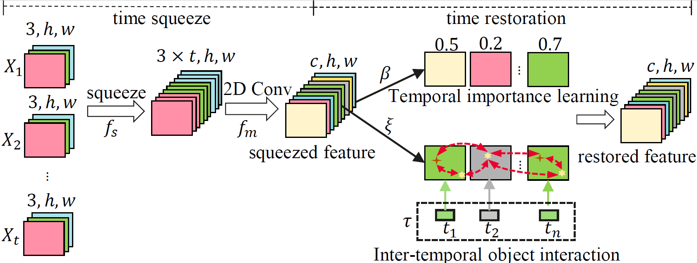
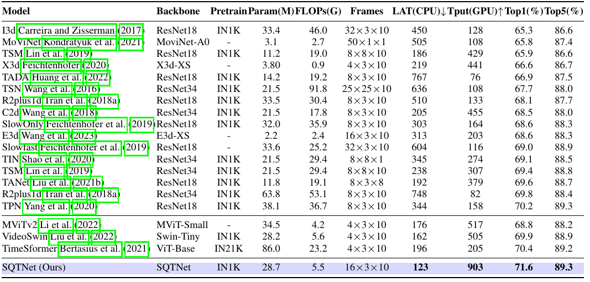
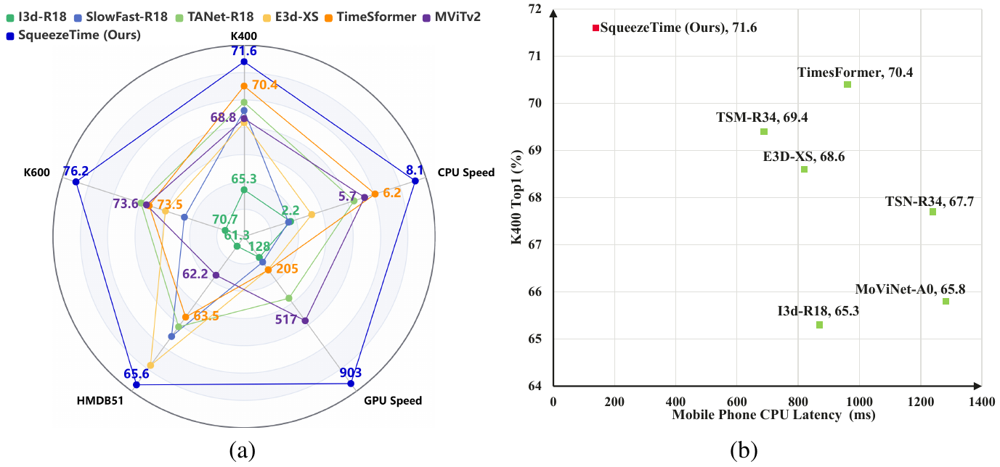

# SqueezeTime

### **No Time to Waste: Squeeze Time into Channel for Mobile Video Understanding**

*Yingjie Zhai, Wenshuo Li, Yehui Tang, Xinghao Chen, Yunhe Wang*

*arXiv 2024* 

[[`arXiv`](https://arxiv.org/pdf/2405.08344)] [[`BibTeX`](#citation)]

## 🔥 Updates
* **2024/05/13**: Pre-trained models and codes of SqueezeTime are released both in [Pytorch](https://github.com/xinghaochen/SqueezeTime) and [Mindspore](https://github.com/mindspore-lab/models/tree/master/research/huawei-noah/SqueezeTime).

## 📸 Overview
This is an official pytorch implementation of our paper "[**No Time to Waste: Squeeze Time into Channel for Mobile Video Understanding**](https://)". In this paper, we propose to squeeze the time axis of a video sequence into the channel dimension and present a lightweight video recognition network, term as **SqueezeTime**, for mobile video understanding. To enhance the temporal modeling capability of the model, we design a Channel-Time Learning (CTL) Block to capture temporal dynamics of the sequence. This module has two complementary branches, in which one branch is for temporal importance learning and another branch with temporal position restoring capability is to enhance inter-temporal object modeling ability. The proposed SqueezeTime is much lightweight and fast with high accuracies for mobile video understanding. Extensive experiments on various benchmarks, i.e., Kinetics400, Kinetics600, SomethingSomethingV2, HMDB51, AVA2.1, and THUMOS14, demonstrate the superiority of our model. For example, our SqueezeTime achieves **+1.2%** accuracy and **+80%** GPU throughput gain on Kinetics400 than prior methods.

<p align="center">
     <br />
 <em> 
    Figure 1: Pipeline of the SqueezeTime.
    </em>
</p>

##  1️⃣ Requirements
The models is based on the mmaction2 project. Please run the models by mmaction2.
1. Clone the [mmaction2](https://github.com/open-mmlab/mmaction2/tree/main/mmaction) project
```bash 
git clone https://github.com/open-mmlab/mmaction2.git
```
Then install mmaction2 following the [offical instruction](https://mmaction2.readthedocs.io/en/latest/get_started/installation.html).

2. Clone this repository
```bash 
git clone https://github.com/xinghaochen/SqueezeTime.git
cd SqueezeTime
```
3. Copy our model files
```
mmaction/models/backbones/SqueezeTime.py
mmaction/models/backbones/SqueezeTime_ava.py
mmaction/models/heads/i2d_head.py
```
into the mmaction folder following the original structure. Then add the reference in the "\__init__.py" of backbones and heads files of the mmaction.

4. Copy the "ckpt", "configs", and "data" folders into the mmaction2 project following the original sturcture.

## 2️⃣ Data Preparation

All dataset are organized using mmaction2 format. Please organize the `data` directory as follows after downloading all of them: 
  - <details>
    <summary> Data Structure Tree </summary>

    ```
    ├── data
        ├── kinetics400
        │   ├── kinetics400_train_list_videos.txt
        │   ├── kinetics400_val_list_videos.txt
        │   └── kinetics_videos/
        ├── kinetics600
        │   ├── kinetics400_train_list_videos.txt
        │   ├── kinetics400_val_list_videos.txt
        │   └── videos/
        ├── hmdb51
        │   ├── hmdb51_train_split_1_videos.txt
        │   ├── hmdb51_train_split_2_videos.txt
        │   ├── hmdb51_train_split_3_videos.txt
        │   ├── hmdb51_val_split_1_videos.txt
        │   ├── hmdb51_val_split_2_videos.txt
        │   ├── hmdb51_val_split_3_videos.txt
        │   └── videos/
        ├── sthv2
        │   ├── sthv2_train_list_videos.txt
        │   ├── sthv2_val_list_videos.txt
        │   └── videos/
        └── ava
            ├── ava_train_v2.1.csv
            ├── ava_val_v2.1.csv
            └── rawframes/
    ```
    </details>
	  
## 3️⃣ Training & Testing

All config files are in 'configs/recognition/' and 'configs/detection/'. The configs for train and test K400, K600, HMDB51, sthv2, and AVA2.1 datasets are in 
```
"configs/recognition/SqueezeTime/SqueezeTime_K400.py",
"configs/recognition/SqueezeTime/SqueezeTime_K600.py",
"configs/recognition/SqueezeTime/SqueezeTime_HMDB51.py",
"configs/recognition/SqueezeTime/SqueezeTime_sthv2.py",
"configs/detection/SqueezeTime_AVA2.1.py".
```

Take the Kinectics400 dataset for an example:
- Train the SqueezeTime on K400:

  `bash tools/dist_train.sh configs/recognition/SqueezeTime/SqueezeTime_K400.py 8 `
- Test the SqueezeTime on K400:

  `bash tools/dist_test.sh configs/recognition/SqueezeTime/SqueezeTime_K400.py ckpts/SqueezeTime_K400_71.64.pth 8 `

Besides, we also provide the configs of other models trained in our paper, please find them in the "configs" folder.

#### Model Checkpoints

| Dataset  | Checkpoints |
|----------|-------|
|ImageNet1K| [Download](https://github.com/xinghaochen/SqueezeTime/releases/download/ckpts/SqueezeTime_in1k_pretrain.pth)|
|K400   | [Download](https://github.com/xinghaochen/SqueezeTime/releases/download/ckpts/SqueezeTime_K400_71.64.pth) |
|K600      | [Download](https://github.com/xinghaochen/SqueezeTime/releases/download/ckpts/SqueezeTime_K600_76.06.pth)| 
|HMDB51| [Download](https://github.com/xinghaochen/SqueezeTime/releases/download/ckpts/SqueezeTime_HMDB51_65.56.pth) |
|AVA2.1     | [Download](https://github.com/xinghaochen/SqueezeTime/releases/download/ckpts/SqueezeTime-AVA2.1.pth)| 

## 4️⃣ Evaluation
The following results are on the Kinetics400 dataset. Please see the paper for the results on other datasets.
<p align="center">
     <br />
 <em> 
    Figure2. Performace comparison of multiple lightweight methods on K400 dataset.
    </em>
</p>
<p align="center">
     <br />
 <em> 
    Figure3. Speed comparison of methods on K400 dataset. (a) CPU and GPU speed, (b) Mobile Phone CPU Latency.
    </em>
</p>


## ✏️ Reference
If you find SqueezeTime useful in your research or applications, please consider giving a star ⭐ and citing using the following BibTeX:
```
@article{zhai2024SqueezeTime,
  title={No Time to Waste: Squeeze Time into Channel for Mobile Video Understanding},
  author={Zhai, Yingjie and Li, Wenshuo and Tang, Yehui and Chen, Xinghao and Wang, Yunhe},
  journal={arXiv preprint arXiv:2405.08344},
  year={2024}
}
```
